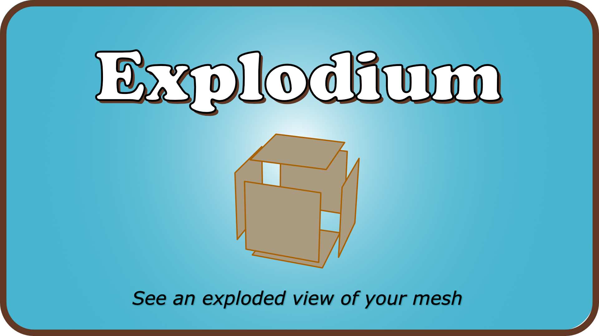
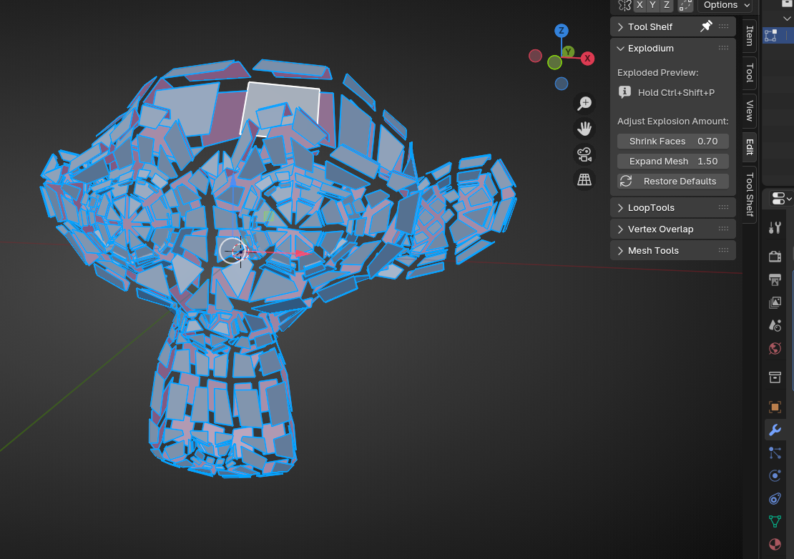
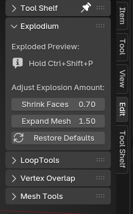
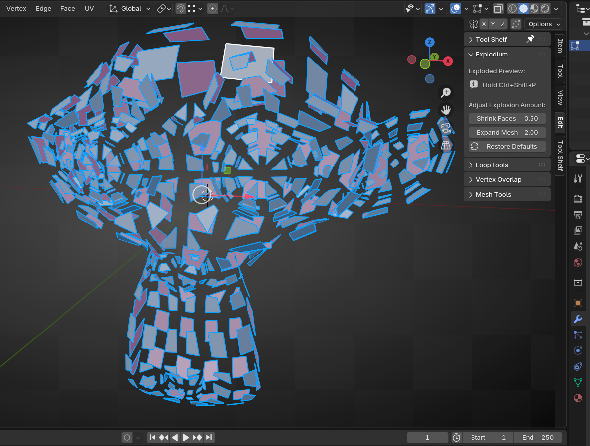
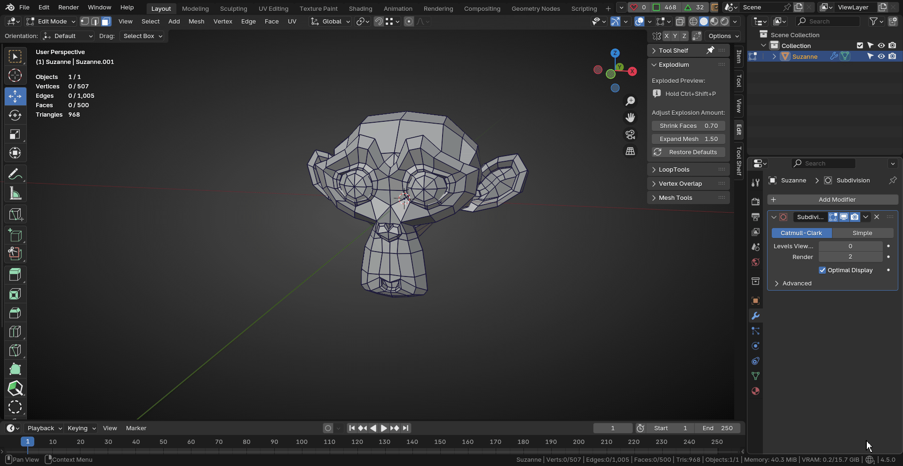
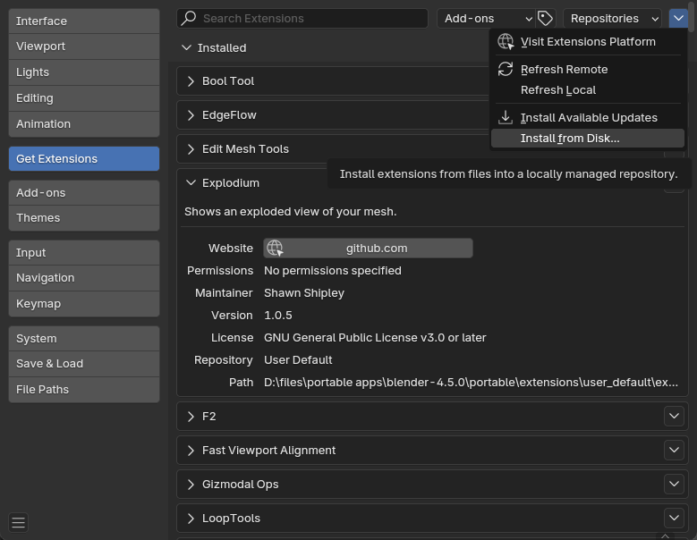

# Explodium
A Blender N-Panel add-on that shows you an exploded view of your mesh. Found under the `Edit` N-Panel.

Explodium is an add-on that shows you an "exploded view" of your mesh. It temporarily separates faces from each other and expands the mesh to give you an overview of your topology. It is non-destructive and only visible while holding the hotkey.
## Usage
- Select an object and switch to Edit mode.
- While holding down your configured hotkey (default is Ctrl+Shift+P) you will see a temporary "exploded view" of your mesh.
- Release the hotkey and the mesh returns to normal.

## Features

-  Provides an exploded view of your mesh, revealing topology, edge flow, and hidden geometry that's difficult to see in normal view.
- Customizable hotkey
- You can customize how much to shrink the mesh faces and expand the overall mesh
- You can reset default values at any time

## Screenshot

Figure 1 - An exploded view of Suzanne

Figure 2 - Customizable hotkeys and explosion values

Figure 3 - An exploded view of Suzanne after tweaking Face and Mesh values

## Video

Figure 4 - Holding down the hotkey (default Ctrl+Shift+P) shows an exploded view of Suzanne. You can adjust the Shrink Face and Expand Mesh values to change how much the mesh expands.

## Supported Blender Versions
Because Explodium is packaged as an Extension, it currently supports Blender 4.2+ and newer.

## Installation Options

### Blender Extensions Platform

Coming soon, hopefully...

### Install from Disk

Explodium can also be installed manually, which you can download from the [Releases](https://github.com/shawnshipley/explodium/releases) section of its [Github](https://github.com/shawnshipley/explodium) page. Just follow the steps below to install:
1. Download the latest [release](https://github.com/shawnshipley/explodium/releases)
2. In Blender, go to Edit -> Preferences
3. Click on `Get Extensions`
4. Click the Extensions Settings drop-down arrow (the small arrow in the upper right corner of the window that's facing down) and select `Install from Disk`.

5. Browse to the downloaded .zip file and select it to complete the installation.

The extension will now show up in the `Edit` N-Panel as `Explodium`.

## Changelog

### 11/19/25 (v1.0.5)
- Initial public release